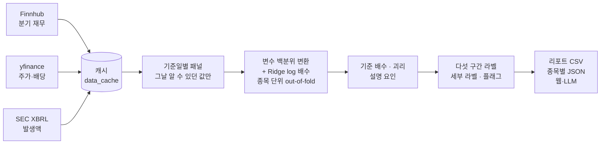

<div align="center">

# 📊 적정 밸류에이션 스크리닝

**미국 상장 종목의 배수가, 같은 날 비슷한 재무를 가진 회사들에 비해 비싼지 싼지를 설명합니다.**


-6f42c1)


</div>

```text
NVDA 2026-10-02  매우 고평가 · 과거 성장 > 요구 성장 (기저 효과 가능)   순위 20/100 (경계)

PER 27.5배  (적정 19.4배, +42%)   높인 요인: 섹터 +54%, 매출성장률 +21%  /  낮춘 요인: ROE −33%(분모 효과), 발생액 −21%
PSR 17.5배  (적정 10.0배, +75%)   높인 요인: 세부 업종 +101%, 영업이익률 +52%  /  낮춘 요인: 자산회전율 −40%(분모 효과)

주가에 반영된 기대: 10년간 중간 종목보다 매년 약 3% 더 성장하면 현재 PER이 설명됨
최근 3년 실제 이익 성장: 연 +167% (중간 종목 +6%) — 3년 전 이익이 작아 기저 효과일 수 있음
종합: 4개 배수 모두 '비싸다' 쪽 (평균 괴리 +42%)
```

> [!IMPORTANT]
> **적정 배수는 내재가치가 아닙니다.** 같은 날 관측 가능한 재무·산업 특성으로 설명되는 *시장의 기준 배수*입니다. **저평가는 모델 기준 할인**일 뿐, 경제적 저평가나 앞으로의 초과수익을 뜻하지 않습니다.
> **수익률 예측 모델이 아닙니다.** 대형주에서 괴리와 이후 수익률의 관계는 유의하지 않았습니다(FDR 보정 후 0/24, [아래](#싸다는-판단이-이후-수익률로-이어졌나)).

---

## 목차

- [무엇을 하나](#-무엇을-하나)
- [빠른 시작](#-빠른-시작)
- [웹·앱 연동 (`publish`)](#-웹앱-연동-publish)
- [결과 읽는 법](#-결과-읽는-법)
- [모델](#-모델)
- [성능과 검증](#-성능과-검증)
- [한계](#-한계)
- [파일 구성](#-파일-구성)
- [실험 이력](#-실험-이력)

---

## 🔎 무엇을 하나

1. 기준일마다 그날의 종목 전체로 **재무 지표 → 배수(PER·PBR·PSR·EV/EBITDA·P/FCF)** 관계를 학습합니다.
2. 각 종목의 **기준 배수**는 그 종목을 뺀 모델로 계산합니다(out-of-fold). 그래서 자기 주가가 자기 기준을 끌어당기지 않습니다.
3. 실제 배수와 기준 배수의 **괴리**를 같은 날 전 종목과 줄 세워 **다섯 구간 라벨**을 붙입니다.
4. 판정마다 **설명 요인, 가격에 반영된 성장률, 경고 플래그, 시장 전체 맥락**이 함께 나옵니다.



| 항목 | 내용 |
|---|---|
| 유니버스 | 대형주 281개(직접 구성) + S&P MidCap 400 + SmallCap 600 **현재** 구성 종목 → 1,261개 |
| 기간 | 2004-01 ~ 현재, 분기 초 스냅샷 + 오늘 (기준일당 약 1,030종목) |
| 재무 | Finnhub 분기 재무(무료 API). 공시일이 없어 분기 말 + 45일(회계연도 4분기는 + 75일)부터 안다고 봄 |
| 발생액 | SEC XBRL 일괄 파일. 순이익·영업현금흐름·자산과 **실제 제출일** |
| 업종 | GICS 섹터·세부 업종(Wikipedia, 현재 분류를 과거에도 적용) |
| 주가·배당 | yfinance (당일까지만 사용) |
| 심리 지표 (설명용) | FINRA 공매도 잔고(2018~), 위키피디아 월별 조회수(2015-07~). **판정에는 쓰지 않음** |
| 시간 구간 | Train 2004~2019 / Val 2020~2023 / Test 2024~ |

> [!NOTE]
> **타깃에는 주가가 들어 있습니다.** 입력은 재무, 타깃은 주가 ÷ 재무(배수)입니다. 현재 가격을 "재무로 설명되는 부분"과 "설명되지 않는 부분(괴리)"으로 나누는 구조입니다.

---

## 🚀 빠른 시작

```bash
pip install -r requirements.txt
python tests/test_pipeline.py              # 합성 데이터 테스트 (API 불필요)

export FINNHUB_API_KEY=...                 # https://finnhub.io/register
python src/main.py build                   # 데이터 수집 + 패널 (처음 30분 이상)
python src/main.py evaluate                # 모델 평가 + 수익률 가설 검정
python src/main.py screen [--ticker AAPL]  # 최신 리포트 + 시장 맥락
python src/main.py publish                 # 정기 작업: 전 종목 분류 → 웹용 파일
```

<details>
<summary><b>다른 명령과 준비 사항</b></summary>

```bash
python src/main.py compare-features [--drop-check]   # 후보 변수 비교 (Train/Val)
python src/main.py export [--as-of 날짜]             # 종목별 JSON -> real_data_output/llm/<날짜>/
python src/main.py explain --tickers AAPL NVDA       # Claude로 한국어 설명 (ANTHROPIC_API_KEY 필요)
python src/main.py explain --submit | --collect      # 전 종목 배치 설명
python src/main.py verify-multiples                  # 배수 주가 보정을 yfinance 값과 비교
```

- **API 키는 환경변수로만** 넘깁니다(`FINNHUB_API_KEY`, `ANTHROPIC_API_KEY`). 코드에 적거나 커밋하지 않습니다.
- **발생액**은 SEC 파일 두 개를 브라우저로 직접 받아 `data_cache/sec/`에 넣어야 계산됩니다(sec.gov가 스크립트 다운로드를 막음): [`companyfacts.zip`](https://www.sec.gov/Archives/edgar/daily-index/xbrl/companyfacts.zip)(약 1.4GB, 압축 풀지 않음), [`company_tickers.json`](https://www.sec.gov/files/company_tickers.json). 없으면 발생액만 비고 나머지는 그대로 돕니다.
- Windows 콘솔에서 한글이 깨지면 `PYTHONIOENCODING=utf-8`을 설정하세요.
- VS Code 셀 실행은 `notebooks/run_local.py`(`# %%` 셀)를 여세요.
- 처음 `build`는 Finnhub 무료 제한(분당 50회) 때문에 30분 이상 걸립니다. 끊기면 다시 실행하면 이어서 받습니다.

</details>

<details>
<summary><b>Colab</b></summary>

```python
# 셀 1: 준비
!pip install -q finnhub-python
import os, sys, importlib
from pathlib import Path
from google.colab import drive, userdata
drive.mount("/content/drive")
os.environ["FINNHUB_API_KEY"] = userdata.get("FINNHUB_API_KEY")
REPO = Path("/content/stock-valuation-model")
DRIVE = Path("/content/drive/MyDrive/stock_valuation")
CACHE, PANEL = DRIVE / "data_cache", DRIVE / "panel.parquet"
sys.path.insert(0, str(REPO / "src"))

# 셀 2: 코드 받기
if REPO.exists():
    !git -C {REPO} pull -q origin dev
else:
    !git clone -q -b dev https://github.com/1230seongjun/stock-valuation-model.git {REPO}
import universe, config, data, features, fair_value, screening, main
for m in (universe, config, data, features, fair_value, screening, main):
    importlib.reload(m)
main.OUTPUT_DIR = DRIVE

# 셀 3~
main.build(cache_dir=CACHE, panel_path=PANEL)
main.evaluate(PANEL)
report = main.screen(PANEL)
```
</details>

---

## 🌐 웹·앱 연동 (`publish`)

웹·앱은 접속할 때 계산하지 않습니다. **정기 작업이 전 종목을 한 번에 분류해 파일로 저장하고, 웹은 그 파일만 읽습니다.**

```bash
python src/main.py publish     # 매일 장 마감 후 한 번
```

| 단계 | 하는 일 | 시간 (1,261종목) |
|---|---|---|
| 1. 수집 | 주가를 모두 새로 받음. 재무는 캐시가 14일 넘은 것만(하루 약 1/14씩 나눠 받아 무료 제한 안). 공매도는 7일, 위키피디아 조회수는 14일마다 다시 받음(그날은 10~15분 더 걸림) | 약 15분 (yfinance) |
| 2. 패널 갱신 | 저장된 패널에 없는 기준일(오늘, 새 분기 시작일)만 계산해 붙임 | 수 초 |
| 3. 분류 | 기준일마다 모델을 새로 학습해 전 종목 판정 (최신일 학습 약 1초) | 약 20초 (파일 쓰기 포함) |
| 4. 저장 | 아래 파일을 임시 폴더에 쓰고 완성되면 교체 → 웹이 반쯤 쓴 파일을 읽지 않음 | |

```text
real_data_output/site/
├── latest.json                    ← 웹이 처음 여는 파일: 날짜, 라벨별 개수, 경로
└── 2026-10-02/
    ├── index.json                 ← 전 종목 한 줄 요약 (라벨, 순위, 괴리, 플래그)
    ├── market_context.json        ← 시장 전체 맥락
    └── AAPL.json, NVDA.json, ...  ← 종목별 상세 (약 18KB)
```

- 날짜 폴더는 최근 14개만 남깁니다(`--keep`). 하루 약 23MB입니다.
- 증분 갱신이 처음부터 다시 만든 패널과 **완전히 같은지** 테스트와 실데이터(80종목)로 확인했습니다.
- 종목별 JSON은 LLM 설명과 웹 화면이 함께 쓰는 **데이터 계약**입니다([구조](#종목별-json-schema-16)).

---

## 📖 결과 읽는 법

### 라벨

같은 날짜의 전 종목을 **종합 괴리**(사용 가능한 배수 괴리의 평균)로 줄 세워 20%씩 나눕니다.

| 라벨 | 뜻 |
|---|---|
| 🟢 **매우 저평가** | 할인이 가장 큰 20% |
| 🟩 저평가 | 그다음 20% |
| ⬜ 중립 | 가운데 20% |
| 🟧 고평가 | 그다음 20% |
| 🔴 **매우 고평가** | 프리미엄이 가장 큰 20% |
| 적자 · (위 다섯 구간) | 적자 기업. PER이 없어 PSR·PBR(양수면 EV/EBITDA·P/FCF도) 괴리를 **전 종목의 같은 배수 기준 괴리와 함께** 줄 세움 |
| ⏸ 판단 보류(재무 위험) | 적자이면서 빚이 많은데 싼 쪽으로 나온 종목. 모델이 부도 위험을 못 보므로 "싸다"고 하지 않음 |
| ⏸ 판단 보류(신규 상장) | 상장 1년 미만이고 배수 하나로만 비교되는 종목 |
| ⏸ 판단 보류(적자) / 데이터 부족 | 비교할 배수가 없음 |

> [!TIP]
> **한 배수의 괴리 수십 %는 오차와 구분되지 않습니다**(오차 중앙값 37~50%). 여러 배수를 평균한 종합 괴리의 **양 끝 20%**에 의미를 두고, 가운데 구간은 방향만 참고하세요. 순위가 기준선(20/40/60/80) 근처면 "경계"로 읽으세요.

- **빚 기준**: 자본잠식, 또는 금융업 외에서 순부채/총자본 1 초과이거나 비금융 기업 중 상위 10%. 대출 회사는 빚이 사업 구조라 제외합니다.
- **금융업**(모기지 리츠 포함)은 PER·PBR만 씁니다. 매출·EBITDA·FCF의 뜻이 달라서입니다.
- 적자 기업은 비싼 쪽에 많습니다(Val+Test 32%가 매우 고평가). 다만 **일회성 손상**인지 **구조적 부진**인지는 구분하지 못합니다.

### 세부 라벨: 가격이 요구하는 성장 vs 과거 성장

| 세부 라벨 | 뜻 |
|---|---|
| 과거 성장 > 요구 성장 | 가격이 요구하는 성장이 지난 3년 실적보다 2%p 이상 낮음 |
| 요구 성장 > 과거 성장 | 가격이 지난 3년보다 2%p 이상 높은 성장을 요구함 |
| 요구 성장 ≈ 과거 성장 | 차이가 ±2%p 안 |
| 흑자 전환 / 성장 이력 없음 | 3년 전 적자 / 지금 적자이거나 이력 3년 미만 |

- **요구 성장**: (1 + x)^10 = PER ÷ 중간 종목 PER. 같은 할인율, 10년 뒤 중간 PER로 수렴한다는 가정의 **단순 상대 지표**이지 DCF가 아닙니다.
- **과거 성장**: 12개월 EPS의 3년 연평균 성장률(은행은 순이익). 어느 쪽이 맞을지는 판단하지 않습니다.
- **"(기저 효과 가능)"**: 3년 성장률이 연 100% 초과. **"(일회성 손익 가능)"**: 재무 단절 플래그가 있음.

### 플래그 (라벨은 바꾸지 않는 경고)

| 플래그 | 조건 |
|---|---|
| 최근 12개월 재무 단절 | 최근 4분기 안에 분기 EPS가 평소와 전년 같은 분기 **둘 다**의 3배 초과·1/3 미만, 또는 주당매출 1.5배 넘게 급변 |
| 재무 기준일 이후 주가 급변 | 마지막 재무 분기 말 이후 주가 −33% 이하 또는 +49% 이상 |
| 한 가지 배수로만 판단 | 중립이 아닌 라벨인데 계산된 배수가 1개 |
| 적자 + 재무 위험 | 위 빚 기준에 해당하는 적자 기업 (싼 쪽이면 판단 보류) |
| 빚 많은 흑자 기업 | 같은 빚 기준의 흑자 기업. 양 끝 판정이 나오기 쉬움(각 약 26%, 보통 20%) |
| 지속 할인·저성장 경고 | 4개 시점 연속 매우 저평가 + 매출성장률 섹터 하위 40% |
| 단기 가격·거래량 이상 | 5거래일 ±15% + 거래량이 63일 평균보다 3표준편차 이상 |
| 매우 저평가 ↔ 매우 고평가 전환 | 직전 시점 대비 양 끝 사이 반전, 원인(주가/실적) 분류 |

플래그가 붙은 종목은 큰 오차가 날 확률이 1.5~2배 높습니다.

### 심리 지표 (판정과 무관한 참고)

괴리의 일부는 시장의 기대와 의심입니다. 설명 문장과 JSON에 두 지표를 함께 보여 줍니다.

| 지표 | 뜻 | 괴리와의 관계 (같은 규모·섹터 안, 2026-10-02 검증) |
|---|---|---|
| 공매도 비율 | 공매도 잔고 ÷ 발행주식 수, 같은 날 백분위 | 많을수록 **더 싸게** 거래 (편상관 −0.16 ~ −0.20) |
| 위키피디아 관심도 | 최근 완료된 3개월 평균 조회수, 같은 규모 그룹 안 백분위 | 높을수록 **더 비싸게** 거래 (+0.13 ~ +0.16) |

```text
NVDA  심리 지표: 공매도 비율 1.3% (백분위 2), 위키피디아 관심도 같은 규모 그룹 백분위 99
      — 관심이 높고 공매도가 적은 종목은 대체로 더 비싸게 거래됨(기대감이 프리미엄에 반영됐을 수 있음)
```

- 둘을 합쳐 괴리의 **약 8%**를 설명합니다. 판정을 바꿀 만큼 크지 않아 **모델 입력으로는 넣지 않았습니다**(2년 전 자기 배수를 통제하면 R² 증가가 기준 미달).
- **원인과 결과를 구분하지 못합니다.** 주가가 오르면 관심이 늘고, 주가가 약하면 공매도가 따라 들어옵니다. "~을 반영했을 수 있음"으로만 읽으세요.
- 공매도는 결제일 약 10일 뒤(공표 시점)부터, 조회수는 기준일 전에 끝난 달만 씁니다.

<details>
<summary><b>설명 요인과 "(분모 효과)"</b></summary>

"적정 PER을 높인 요인 섹터 +54%"는 **모델상 기여**이지 인과관계가 아닙니다. 일부 요인은 배수를 계산하는 **식 자체 때문에** 기준 배수를 움직여 "(분모 효과)"가 붙습니다.

| 배수 | 요인 | 식 |
|---|---|---|
| PER | ROE | PER = PBR ÷ ROE |
| PBR | 자본 규모 | 자본이 분모 |
| PSR | 자산회전율, 매출 규모 | 매출이 분모 |
| EV/EBITDA | 자산회전율 | (EV ÷ 자산) ÷ (자산회전율 × EBITDA 마진) |
| P/FCF | FCF이익률, 현금 전환율, 매출 규모 | PSR ÷ FCF이익률 |

PER의 ROE 계수가 음수인 것도 이 식 구조가 섞인 결과라 "시장이 수익성 하락을 예상한다"로 읽을 수 없습니다.
</details>

<details>
<summary><b>참고 열과 시장 전체 맥락</b></summary>

- **정규화 PER**: 주가 ÷ (최근 12분기 평균 EPS × 4). 일회성 분기의 무게를 줄인 참고용이며 종합 판단에는 넣지 않습니다.
- **sector_valuation_rank**: 모델 없이 섹터 안에서만 비교한 순위. **quality_score / momentum_score**: 섹터 내 백분위 평균.
- **시장 전체 맥락**: 라벨은 같은 날 종목끼리의 상대 비교라 시장 전체가 비싼지는 알려 주지 않습니다. 그래서 S&P 500 CAPE를 10년 금리·물가·실업률로 설명되는 수준과 비교한 값을 따로 저장합니다(1990~2015 학습 고정, 표본 밖 R² +0.30). 기준일 전에 발표된 가장 최근 달을 씁니다. **예측이 아니고 라벨과도 무관합니다.** VIX·신용 스프레드는 주가와 같이 움직여 넣지 않았습니다. 데이터: [shillerdata.com](https://shillerdata.com/), FRED.
</details>

<details>
<summary><a id="종목별-json-schema-16"></a><b>종목별 JSON (schema 1.6)</b></summary>

| 파일 | 내용 |
|---|---|
| `<TICKER>.json` | 판정(라벨, 세부 라벨, 순위, 종합 괴리, 경계 여부), 배수별 실제·적정·괴리와 설명 요인, 비교 못 한 배수와 이유, 성장 비교, 주요 재무(값·백분위·모델 사용 여부), 플래그와 이유, 그날의 모델 적합도, **해석 규칙** |
| `index.json` | 전 종목 한 줄 요약과 모델 적합도 |
| `market_context.json` | 시장 전체 맥락 |

- `interpretation_rules`: LLM이 지켜야 할 문장(적정 배수는 내재가치가 아님, 수익률 예측이 아님, 요인은 인과가 아님, 파일에 없는 숫자는 만들지 않음 등).
- `sentiment`: 공매도 비율·관심도와 백분위(판정과 무관). `cash_backing`: 이익 대비 영업현금흐름과 1년 전 비율. `without_accruals`: 발생액을 뺀 라벨. `near_label_boundary`: 기준선에서 순위 3 이내.
- 백분율은 % 단위(+74.0 = 74% 높음), 값이 없으면 `null`. 구조가 바뀌면 `schema_version`을 올립니다.
</details>

---

## 🧠 모델

| 배수 | 사용 범위 | 비고 |
|---|---|---|
| PER | 1 ~ 100, 흑자 | |
| PBR | 0.1 ~ 20 | |
| PSR | 0.05 ~ 40 | 금융업 제외 |
| EV/EBITDA | 1 ~ 60 | 금융업 제외 |
| P/FCF | 1 ~ 100 | 금융업 제외 |
| 정규화 PER | 1 ~ 100 | 참고용 |

| 입력 변수 | |
|---|---|
| 모든 배수 공통 | ROE, 영업이익률, 매출성장률, 부채비율, 배당성향, 63일 변동성, 매출총이익률, 섹터 |
| PER에 추가 | 자본 규모, 3년 평균 ROE, **발생액** (금융업 제외) |
| PBR에 추가 | 순부채비율, 자본 규모, 3년 평균 ROE, 매출 규모, 이익 변동성 |
| PSR에 추가 | 자산회전율, 매출 규모, 세부 업종 |
| EV/EBITDA에 추가 | 자산회전율 |
| P/FCF에 추가 | FCF이익률, 이익의 현금 전환율, 매출 규모 |

- **기준일마다 따로 학습**합니다. 그날의 종목만 쓰고 다른 날짜의 데이터는 쓰지 않습니다. 변수는 그날 백분위로 바꿔 넣고, 빈 값은 중앙값 + 결측 표시로 채웁니다.
- **Ridge + 종목 단위 5-fold out-of-fold**. 계수를 읽을 수 있고 변수끼리 상관이 커서 택했습니다. XGBoost는 Train만 좋아졌습니다(과적합).
- **주가에서 나온 값은 넣지 않습니다**(모멘텀, 52주 고점, 배당수익률, 시가총액). 주가 하락을 "원래 싸야 할 종목"으로 설명해 버리기 때문입니다. 63일 변동성만 위험 대용으로 예외입니다.
- **애널리스트 전망치는 넣지 않습니다.** 과거 시점 값을 무료로 구할 수 없고, 넣으면 시장의 기대를 입력에 다시 넣는 셈입니다.
- **미래 데이터 차단** 규칙은 모두 `src/features.py`에 있고, 미래 데이터를 뒤섞어도 과거 행이 바뀌지 않는지 테스트합니다.
- **Train/Val/Test**는 "과거 모델을 미래에 적용"하는 검증이 아니라, Train·Val로 정한 설계가 다른 시대 단면에서도 유지되는지 보는 용도입니다.
- **변수 채택 규칙**: `compare-features`에서 Train과 Val R²를 **모두 +0.01 이상** 올릴 때만 넣습니다. 새 실험은 판정 기준을 먼저 정하고, 원본 코드를 고치지 않은 채 시험합니다.

<details>
<summary><b>변수 정의</b></summary>

| 변수 | 정의 |
|---|---|
| ROE, 영업이익률, 매출총이익률, 부채비율, 배당성향, 자산회전율, 순부채비율, FCF이익률 | Finnhub 계산값 (`roeTTM`, `operatingMargin`, `grossMargin`, `totalDebtToEquity`, `payoutRatioTTM`, `assetTurnoverTTM`, `netDebtToTotalCapital`, `fcfMargin`) |
| 매출성장률 | 분기 주당매출의 전년 같은 분기 대비 변화율 |
| 63일 변동성 | 최근 63거래일 일간 수익률 표준편차 × √252 |
| 3년 평균 ROE | 최근 12분기 `roeTTM` 평균 (최소 8분기) |
| 자본 규모 / 매출 규모 | log(자본총계) / log(12개월 매출). 주가가 섞이지 않게 계산 |
| 이익 변동성 | 최근 12분기 EPS 표준편차 ÷ 평균 |
| 이익의 현금 전환율 | 12분기 평균 FCF이익률 ÷ 12분기 평균 순이익률 |
| 발생액 | (12개월 순이익 − 영업현금흐름) ÷ 자산. SEC XBRL, 같은 회계기간, 기준일까지 **실제 제출된** 최초 제출본만 |
| 세부 업종 | GICS 세부 업종 중 20종목 이상인 13개, 나머지는 "섹터 기타" |
</details>

---

## 📈 성능과 검증

2026-09-30 기준, 1,261종목, 92개 시점. 모든 수치는 out-of-fold입니다. R²는 **현재 배수의 종목 간 차이 중 재무로 설명되는 비율**이지 미래 예측력이 아니며, 비교 기준은 항상 섹터 중앙값입니다.

| 배수 | 섹터 중앙값 기준선<br>Train / Val / Test | **모델**<br>Train / Val / Test | 순위 상관<br>(Val) | 오차 중앙값 / 상위 10%<br>(Val) |
|---|---|---|---|---|
| PSR | 0.23 / 0.23 / 0.18 | **0.71 / 0.64 / 0.65** | 0.81 | 50% / 186% |
| PBR | 0.13 / 0.19 / 0.11 | **0.51 / 0.52 / 0.54** | 0.73 | 41% / 151% |
| PER | 0.08 / 0.18 / 0.17 | **0.39 / 0.44 / 0.36** | 0.66 | 38% / 137% |
| EV/EBITDA | 0.13 / 0.13 / 0.18 | **0.25 / 0.25 / 0.25** | 0.48 | 37% / 139% |
| P/FCF | 0.01 / 0.08 / 0.05 | **0.27 / 0.29 / 0.24** | 0.54 | 49% / 180% |

- ✅ 다섯 배수 모두 기준선보다 높고, 시대가 바뀌어도 크게 떨어지지 않습니다. 분모 효과 요인을 모두 빼도 기준선 위입니다.
- ✅ **라벨이 분기마다 크게 흔들리지 않습니다**: 직전 분기와의 순위 상관 0.84~0.89, 양 끝 사이 직접 반전 0.1~0.3% (예전 세 구간 기준).
- ✅ **계산 방식에 강건합니다**: 종합 괴리를 평균 대신 중앙값·설명력 가중·표준화 잔차로 바꿔도 라벨의 93~95%가 같습니다.
- ✅ **양 끝 라벨은 배수 간에 일관됩니다**: 배수의 98%가 같은 방향이고, 5개 모두 같은 방향이 91~93%입니다.
- ✅ **극단적 성장도 반영됩니다**: 매출성장 상위 5%가 비싼 쪽으로 쏠리지 않았고(Train −7.6%, Val +0.1%), 성장률 크기 변수를 넣어도 달라지지 않았습니다.

<details>
<summary><b>모델이 기대는 것</b></summary>

변수 그룹을 통째로 뺐을 때 잃는 Val R²:

| 그룹 | PER | PBR | PSR | EV/EBITDA | P/FCF |
|---|---|---|---|---|---|
| 수익성 (ROE, 이익률, 3년 평균 ROE) | **0.140** | **0.117** | 0.073 | 0.026 | 0.033 |
| 성장 (매출성장률) | 0.008 | 0.007 | 0.007 | 0.007 | 0.011 |
| 배수별 구조 변수 | 0.025 | 0.060 | 0.067 | 0.011 | **0.084** |

- 모델은 대부분 **수익성**과 **구조 변수**에 기대고, 과거 성장은 거의 기여하지 않습니다. 남은 차이(미래 기대, 브랜드, 유동성, 사건)가 무엇인지는 구분하지 못했습니다.
- 표본 크기는 주된 한계가 아닙니다. 종목을 75% → 100%로 늘려도 Val R²가 +0.002~0.019 오르는 데 그칩니다.
- 2년 뒤 실제 실적을 알아도 +0.03에 그쳐, 재무로 배수를 설명하는 일은 한계에 가깝습니다.
</details>

<details>
<summary><b>발생액 (2026-10-01 채택, PER만)</b></summary>

이익이 현금흐름보다 크게 잡힌 회사일수록 기준 PER이 낮습니다(2012년 이후 모든 기준일에서 계수 음수).

| PER (2012년 이후) | 기존 | 발생액 추가 |
|---|---|---|
| R² Train / Val / Test | 0.398 / 0.427 / 0.343 | 0.410 / 0.439 / 0.359 |
| 오차 상위 10% (Val) | 141% | 137% |

- 미리 정한 점검 6개 중 5개 통과(무작위 대조, 연도별, 규모별, 재무 단절 제외, ROA 통제). 정규화 PER에서는 미달이라 순수한 "이익의 질" 효과로 읽지 않습니다.
- 금융업은 영업현금흐름에 대출·예금이 섞여 제외합니다. XBRL이 없는 2010년 전 기준일에는 효과가 없습니다.
</details>

<details>
<summary><b>어디서 크게 틀리나</b></summary>

평균적인 치우침은 작고(대부분 ±0.05 log) **개별 종목의 흩어짐이 큽니다.** 큰 오차(|잔차| > 0.8)는 Val 15%, Test 14%이고 한 원인으로 모이지 않습니다.

| 요인 | 큰 오차 확률 배율 (Val / Test) | 행 비중 |
|---|---|---|
| 주당매출 급변 (분사·합병·데이터) | **1.8 / 2.1** | 6% |
| 현재 적자 | **1.9 / 2.1** | 11% |
| ROE 하위 20% | **1.5 / 1.6** | 15% |
| 흑자 전환 / 매출성장 상위 20% / 배수 1~2개 | 1.5 / 1.5 | 11~20% |
| 일회성 EPS 분기 | 1.4 / 1.5 | 30% |
| 소형주 | 1.2 / 1.2 | 44% |

- 큰 오차의 39%에는 어떤 플래그도 없습니다. 플래그로 "신뢰도"를 매기는 것은 미리 정한 기준(2배)에 못 미쳐(1.7~2.0배) 넣지 않았습니다.
- 극단값은 오래 갑니다. 가장 싼 5%의 93%, 가장 비싼 5%의 95%가 다음 분기에도 같은 구간에 남습니다.
</details>

<details>
<summary><b>규모 쏠림</b></summary>

2026-10-02, 흑자 기업 라벨 수:

| 규모 | 매우 저평가 | 저평가 | 중립 | 고평가 | 매우 고평가 |
|---|---|---|---|---|---|
| 대형 | 25 | 32 | 44 | 74 | 75 |
| 중형 | 65 | 80 | 72 | 66 | 81 |
| 소형 | 130 | 109 | 106 | 81 | 64 |

같은 재무라도 소형주는 배수가 낮게 거래되고, 주가가 섞이지 않은 규모 변수로는 이를 빼지 못했습니다(계수가 음수, 분모 효과). **소형주 할인은 괴리에 남겨 둡니다.** 규모별로 나눠 보세요.
</details>

### "싸다"는 판단이 이후 수익률로 이어졌나

모델 설정과 무관한 **탐색적 검정**입니다. 날짜마다 할인 순위와 이후 1·3·6·12개월 수익률의 순위 상관(IC)을 보고 Newey-West와 FDR 보정을 적용했습니다(거래비용 미반영).

**결과: 13/96 유의** — 전체 3/24, **대형 0/24**, 중형 4/24, 소형 6/24.

- **수익률 예측력으로 읽으면 안 됩니다.** 중소형주 목록은 현재 구성 종목이라 과거에 망한 종목이 빠져 있고(생존 편향), 유의한 칸은 중소형주·Val 12개월에 몰려 있습니다. 생존 편향이 거의 없는 대형주는 0/24입니다.
- 심리 신호(공매도, 내부자 거래, 위키피디아 관심도)도 대형주 수익률을 예측하지 못했습니다(2026-10-02, [실험 이력](#-실험-이력)).
- 소형주 효과는 단기 반전을 통제해도 그대로였습니다. 생존 편향 쪽으로 해석하지만, 상장폐지 데이터 없이는 구분할 수 없습니다.

---

## ⚠️ 한계

- **모델이 보지 못하는 것은 모두 괴리에 들어갑니다.** 브랜드·해자·경영진, 미래 성장 기대, 유동성과 투자 심리. 그래서 AAPL·COST처럼 프리미엄을 받는 기업이 늘 "고평가"로 나옵니다. 세부 라벨(요구 성장 vs 과거 성장)을 함께 보세요.
- **12개월 합산 재무는 일회성 항목에 약합니다.** 매우 저평가 상위에 흑자 전환·일회성 손익 종목이 많습니다. 재무 단절 플래그를 확인하세요.
- **부도 위험을 보지 못합니다.** 빚 많은 적자 기업은 판단을 보류하지만, 흑자 기업은 경고만 붙습니다.
- **섹터가 넓고 분류를 과거에 소급합니다.** 세부 업종은 PSR에만 들어갔습니다.
- **재무 공시 시점은 고정 지연 가정**입니다(10-Q 45일, 10-K 75일). 표본에서 10-Q의 99.7%, 10-K의 99.4%가 그 안에 공시됐습니다.
- **생존 편향**: 현재 구성 종목을 과거에 소급합니다. 설명력에는 영향이 작지만 수익률 검정은 부풀려질 수 있습니다.

---

## 🗂 파일 구성

| 파일 | 역할 |
|---|---|
| `src/config.py` | 날짜, 배수·변수 설정, 라벨 기준 |
| `src/universe.py` | 유니버스·섹터·세부 업종 |
| `src/data.py` | yfinance·Finnhub·SEC 수집, 캐시, 품질 검사 |
| `src/features.py` | 시점별 패널. **미래 데이터 차단 규칙은 모두 여기** |
| `src/fair_value.py` | 기준 배수 모델, 평가 지표, 수익률 검정 |
| `src/screening.py` | 라벨, 세부 라벨, 설명 문장, 플래그 |
| `src/market_context.py` | 시장 전체 CAPE vs 거시 기준 수준 (서술용) |
| `src/llm_context.py` | 종목별 JSON (웹·LLM 공용) |
| `src/llm_explain.py` | Claude API로 한국어 설명 생성·검수 |
| `src/publish.py` | 정기 작업: 패널 증분 갱신, 웹용 파일 쓰기 |
| `src/main.py` | 명령줄 진입점 |
| `tests/test_pipeline.py` | 합성 데이터 테스트 58개 |

테스트가 확인하는 것: 미래 데이터 차단(뒤섞어도 과거 행 불변, 4분기 75일, 발생액은 SEC 제출일 이후에만), out-of-fold, 심어 둔 가격 오류 복원, 병렬·순차 결과 일치, 캐시 보호, 증분 갱신 = 전체 재생성, 라벨·플래그·판단 보류 조건.

---

## 🧪 실험 이력

<details>
<summary><b>펼쳐 보기</b> (기각한 실험 포함)</summary>

| 날짜 | 한 일 | 결론 |
|---|---|---|
| 09-14~18 | 지표 11개로 수익률 예측 | FDR 후 0/60 유의, 섹터 평균 기준선도 못 넘음 → **중단** |
| 09-23 | 섹터 대비 단순 순위 | 성장·수익성 높은 회사가 모두 "비쌈" → 재무로 기준 배수를 학습하는 모델로 전환 |
| 09-23~29 | 기준 배수 모델, 백분위 변환, 중소형주 확장 | 5개 배수 모두 기준선 이상, XGBoost는 과적합 → Ridge 유지 |
| 09-30 | 요구 성장, 세부 라벨, 분모 효과, 공시 지연, 세부 업종 | 4분기만 75일, 세부 업종은 PSR만, 공통 변수 2개 제외 |
| 09-30 | 구조 변경 후보, 오차 진단, 신뢰도 점수 | 구조 변경·신뢰도 표시 모두 기각. 문제는 개별 종목의 흩어짐 |
| 10-01 | 위험·유동성, 조정 이익 PER, R&D·SBC·Capex, 섹터별 계수, 텍스트 군집 | 모두 기각 (SBC는 주가를 따라감, 텍스트 군집은 Train에서 악화) |
| 10-01 | 발생액 | PER에서 통과(점검 6개 중 5개) → 사용자 판단으로 채택, 기준선 `baseline-2026-10-01` |
| 10-01 | 거시 환경과 계수, 시장 전체 밸류에이션, 회사채 순발행 | 계수 변화는 약함. CAPE vs 거시를 **서술용 맥락**으로 추가. 회사채 순발행 기각 |
| 10-02 | 적자 기업 판정, 다섯 구간 라벨 | 적자 기업을 전체 종목과 같은 잣대로 비교, 20%씩 다섯 구간 |
| 10-02 | 빚 많은 적자 기업이 "매우 저평가"로 나오는 결함 | 변수 추가(0.95배)·EV/매출(0.79배) 모두 미달 → 규칙으로 판단 보류 |
| 10-02 | 라벨·알고리즘 점검 | 빚 기준에서 대출 회사 제외, 신규 상장 판단 보류, 빚 많은 흑자 기업 경고 |
| 10-02 | 극단적 성장이 순위 변환 때문에 덜 반영되는지 | 쏠림 없음(사전 기준 +10% 미달), 성장률 크기 변수 3종 모두 기각 |
| 10-02 | 심리 데이터 8종(위키피디아 관심도, 공매도, 내부자 거래, 소비자심리, 신용융자, 풋콜·VIX, 정책 불확실성) | 모델 입력(R²)으로는 모두 기각. 시장 전체 지표는 CAPE 모델에서도 기각. **공매도 비율·관심도는 괴리 설명력이 일관돼 설명 항목으로 추가**(판정 불변). 내부자 순매수는 Train −0.099로 기준(0.10) 미달. 기관 보유·AAII는 데이터 차단으로 미시험 |
| 10-02 | 심리 신호 5종 → 이후 수익률 (대형주 기준, 480칸 전체 FDR) | 공매도·내부자 순매수·관심도·관심 급증 기각. 내부자 매수자 수(12개월)만 형식상 통과했지만 Val(2020~23)에서만 IC +0.105, Train +0.004·Test +0.001이고 상위-하위 수익률 차이는 Train·Test에서 반대 → **실질 기각**. 공매도는 대형주 모든 구간에서 '많을수록 이후 수익률 낮음' 방향이 일관됐지만 유의하지 않음(2018년부터라 기간 짧음) |
| 10-02 | 코드 간소화, 웹용 정기 작업(`publish`) | 출력 동일 확인, 패널 생성 약 5배 빨라짐. 전 종목 분류 약 20초 |

더 자세한 수치는 git 기록에 있습니다(간소화 전 `src/config.py` 주석은 커밋 `6989146`).
</details>
